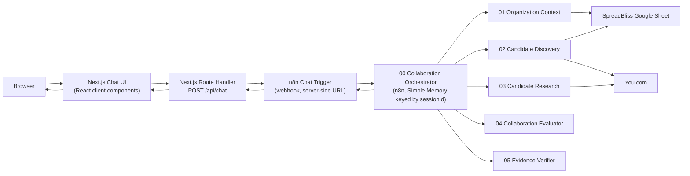

# SpreadBliss Collaboration Intelligence

## Overview

SpreadBliss Collaboration Intelligence is a standalone chat UI for an existing
n8n multi-agent Collaboration Intelligence workflow. A central n8n
orchestrator receives a nonprofit's request, retrieves its profile, discovers
possible partners, researches them, scores collaboration fit, verifies the
supporting evidence, and returns up to three recommendations.

**n8n handles** (one workflow per responsibility):

- nonprofit context — `01_Get_Organization_Context`
- candidate discovery — `02_Candidate_Discovery_Agent`
- You.com research — `03_Candidate_Research_Agent`
- collaboration evaluation — `04_Collaboration_Evaluator`
- evidence verification — `05_Evidence_Verifier`
- conversational memory — Simple Memory on `00_Collaboration_Orchestrator`

**This Next.js project handles:**

- chat UX
- session management
- secure API proxying
- safe response rendering
- error handling

This repository never reimplements the n8n workflow.

## Architecture


Editable source: [docs/architecture-diagram.svg](./docs/architecture-diagram.svg).



The browser submits a message to `POST /api/chat`, and the route validates the
request before making a server-only fetch to `N8N_CHAT_WEBHOOK_URL`. The
server sends `{action:"sendMessage", sessionId, chatInput}` to the n8n Chat
Trigger, which returns `{ "output": string }`. The response is normalized into
the browser `ChatResponse` contract and rendered as safe Markdown or validated
recommendation cards. See [docs/architecture.md](./docs/architecture.md) for
the detailed lifecycle, the n8n workflow responsibilities, and module
boundaries.

### Inside the n8n workflow

The n8n side keeps organization lookup, discovery, research, scoring, and
evidence verification in separate workflows so that no single agent can invent
a candidate, score it, and approve its own unsupported recommendation.

| Workflow | Responsibility |
| --- | --- |
| `00_Collaboration_Orchestrator` | Chat-facing entry point. Extracts organization, objective, geography, programs, and population; uses Simple Memory so it does not re-ask for supplied details; runs research → evaluation → verification per candidate; allows one targeted research retry; ranks supported candidates and returns at most three. |
| `01_Get_Organization_Context` | Looks up the nonprofit profile (ID or name) in the SpreadBliss organization Google Sheet and returns a normalized profile: location, mission, programs, populations, cause tags, collaboration needs. |
| `02_Candidate_Discovery_Agent` | Builds the initial partner pool from the internal sheet and You.com, favouring complementary capabilities over identical work; excludes the source organization and requires evidence for every candidate. |
| `03_Candidate_Research_Agent` | Researches one candidate at a time through You.com, prioritising official and authoritative sources; records concerns, gaps, evidence quality, and source URLs; treats web content as untrusted data. |
| `04_Collaboration_Evaluator` | Scores six dimensions (0–100 each) from the supplied profiles and research packet only; a code node validates the values and computes the weighted overall score. |
| `05_Evidence_Verifier` | Checks that the recommendation is supported by the evidence, lists unsupported claims and gaps, grades evidence strong / moderate / weak / insufficient, and requests more research only for material gaps. |

End-to-end decision flow: request → retrieve context → discover candidates →
research → evaluate → weighted score → verify (one targeted retry back to
research if a material gap is found) → rank supported candidates → return up
to three.

Scoring weights: program complementarity 25%, mission alignment 20%,
geographic alignment 15%, population alignment 15%, collaboration opportunity
15%, evidence quality 10%. Responses can be success, partial, needs-input, or
error; the UI renders each as an ordinary assistant message. No outbound
outreach or contact tool is connected to the orchestrator.

## Setup

### Requirements

- Node.js 24 LTS
- npm 11+

Check the installed Node.js version:

```bash
node --version
```

### Install

```bash
npm install
```

### n8n Chat Trigger prerequisite

Use an already-deployed n8n workflow whose Chat Trigger accepts this JSON POST:

```json
{
  "action": "sendMessage",
  "sessionId": "<opaque session id>",
  "chatInput": "<user message>"
}
```

The trigger should respond with `{ "output": string }`. Optional Basic auth
can be configured with the two Basic-auth environment variables below. See
[docs/n8n-integration.md](./docs/n8n-integration.md) for the integration
contract and supported response normalization.

### Environment variables

Copy the example file, then fill in the local server-only values:

```bash
cp .env.example .env.local
```

| Name | Required | Description |
| --- | --- | --- |
| `N8N_CHAT_WEBHOOK_URL` | Yes | Server-only n8n Chat Trigger URL. |
| `N8N_CHAT_BASIC_AUTH_USER` | No | Optional Basic-auth username; set together with the password. |
| `N8N_CHAT_BASIC_AUTH_PASSWORD` | No | Optional Basic-auth password; set together with the username. |
| `N8N_REQUEST_TIMEOUT_MS` | No | Positive request timeout in milliseconds; defaults to `180000`. |

Never use a `NEXT_PUBLIC_` prefix for these variables, and never commit
`.env.local` or any credentials.

### Development

```bash
npm run dev
```

Open [http://localhost:3000](http://localhost:3000).

### Testing

Run the lint, typecheck, and mocked Vitest suite:

```bash
npm run lint
npm run typecheck
npm test
```

Vitest tests mock all n8n and fetch interactions. `tests/setup.ts` strips
`N8N_*` environment variables before tests run.

Install the Playwright browser once, then run the E2E suite:

```bash
npx playwright install chromium
npm run test:e2e
```

The E2E command builds the application, starts the production server on a
free port (or the port specified by `E2E_PORT`), mocks `/api/chat` in the
browser, and never calls n8n.

### Production build

```bash
npm run build
npm start
```

The default port is 3000. `.env.local` or the real runtime environment must
provide `N8N_CHAT_WEBHOOK_URL`.

## Security

- The webhook URL is server-only: `lib/env.ts` and `lib/n8n/client.ts` import
  `server-only`.
- Credentials remain server-only; the Basic auth header is built at request
  time and credentials are never logged.
- Server validation requires a non-empty message of at most 4,000 characters,
  bounds opaque session IDs, and rejects malformed JSON. The browser
  re-validates response and recommendation data with type guards, and
  `sessionStorage` is treated as untrusted input.
- Markdown uses `react-markdown` and `remark-gfm` with `skipHtml` and an
  element allowlist; raw HTML and `dangerouslySetInnerHTML` are not used.
- External links allow only HTTP(S), use `target="_blank"`, and include
  `rel="noopener noreferrer nofollow"`.
- Client errors are generic, while server logs contain only structured
  request ID, status, latency, and session-hash information.

See [docs/security.md](./docs/security.md) for the complete security
decisions.

## Known limitations

- There is no authentication.
- There is no persistent account-level conversation history; transcripts use
  `sessionStorage`, survive refresh, and are cleared by New conversation or
  tab close.
- Outbound collaboration outreach is intentionally not provided.
- Response speed depends on research providers and n8n; observed live latency
  is 4–45 seconds and the default timeout is 180 seconds.
- Recommendations depend on the evidence available to the research workflow.

## Project structure

```text
app/
  api/chat/route.ts
  favicon.ico
  globals.css
  layout.tsx
  page.tsx
components/
  chat/
    AssistantMessage.tsx
    ChatComposer.tsx
    ChatHeader.tsx
    ChatShell.tsx
    Conversation.tsx
    EmptyState.tsx
    ExternalLinkAnchor.tsx
    LoadingMessage.tsx
    MarkdownContent.tsx
    RecommendationCard.tsx
    SuggestedPrompt.tsx
    UserMessage.tsx
docs/
  architecture-diagram.png
  architecture-diagram.svg
  architecture.md
  demo-script.md
  n8n-integration.md
  security.md
e2e/
  chat.spec.ts
  errors.spec.ts
  helpers/mock-chat.ts
  mobile.spec.ts
  refresh.spec.ts
lib/
  chat/
    api-transport.ts
    error-messages.ts
    markdown.ts
    recommendation-guards.ts
    session.ts
    storage.ts
    types.ts
    validation.ts
  env.ts
  logging.ts
  n8n/
    client.ts
    describe-shape.ts
    errors.ts
    normalize-response.ts
    types.ts
scripts/
  e2e.mjs
tests/
  api-transport.test.ts
  client.test.ts
  components/AssistantMessage.test.tsx
  components/ChatComposer.test.tsx
  components/ChatShell.test.tsx
  components/EmptyState.test.tsx
  describe-shape.test.ts
  error-messages.test.ts
  logging.test.ts
  normalize-response.test.ts
  recommendation-guards.test.ts
  route.test.ts
  security.test.ts
  session.test.ts
  setup.ts
  storage.test.ts
  stubs/server-only.ts
  validation.test.ts
public/
  .gitkeep
.gitignore
.env.example
AGENTS.md
README.md
package-lock.json
eslint.config.mjs
next.config.ts
package.json
playwright.config.mts
postcss.config.mjs
tsconfig.json
vitest.config.mts
```

## Documentation

- [AGENTS.md](./AGENTS.md)
- [Architecture](./docs/architecture.md)
- [n8n integration](./docs/n8n-integration.md)
- [Security decisions](./docs/security.md)
- [Demo script](./docs/demo-script.md)
