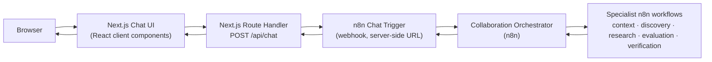
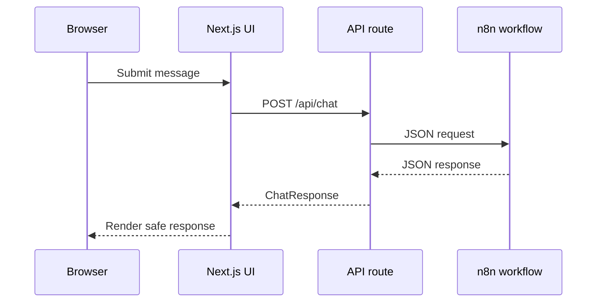

# Architecture

## Purpose

This repository is a thin, secure front door for an existing n8n
Collaboration Intelligence workflow. It owns the browser experience, request
validation, server-to-n8n transport, response normalization, safe rendering,
and conversation state; n8n remains the source of truth for agentic research
and recommendations.

## System context

## Request lifecycle

1. The user submits a message from the chat composer.
2. The UI adds the user message optimistically and shows
   “Researching and verifying potential partners…”.
3. The browser sends `POST /api/chat` with `{ sessionId, message }`.
4. The route validates the JSON body, message, and opaque session ID.
5. `buildN8nRequest` creates `{ action, sessionId, chatInput }`.
6. The n8n client fetches with an `AbortController` and configured timeout.
7. `normalizeN8nResponse` accepts `output`, `text`, `message`, `response`,
   `answer`, arrays, or strings, and optionally validates recommendations.
8. The server returns the normalized `ChatResponse`.
9. Browser transport type guards create a fresh safe response shape.
10. The UI renders assistant text as safe Markdown and structured
    recommendations as validated cards.

## Sequence

## Session model

- The browser creates an opaque session ID with `crypto.randomUUID()`.
- The same ID is sent across follow-ups and retry requests.
- New conversation creates a new ID, aborts any in-flight request, clears the
  visible transcript, and ignores stale results from the prior conversation.
- `sessionStorage` restores the session and transcript after refresh.
  Restoration is defensive: stored values are treated as untrusted and passed
  through validation and recommendation guards.

## Error taxonomy

| Server code | HTTP | Browser copy |
| --- | ---: | --- |
| `invalid_request` | 400 | We couldn't complete that research request. Please try again. |
| `not_configured` | 503 | The research service is temporarily unavailable. |
| `upstream_auth`, `upstream_not_found`, `upstream_rejected` | 502 | The research service is temporarily unavailable. |
| `upstream_timeout` | 504 | Research took longer than expected. Please try again. |
| `upstream_rate_limited` | 429 | The research service is busy. Please try again shortly. |
| `upstream_unavailable` | 502 | The research service is temporarily unavailable. |
| `upstream_malformed` | 502 | We couldn't process the research response. |
| Browser network failure | — | We couldn't reach the research service. |
| Other non-transport errors | — | We couldn't complete that research request. Please try again. |

The server mappings are defined in `lib/n8n/errors.ts` and the HTTP responses
are assembled in `app/api/chat/route.ts`.

## Module map

| File or directory | Responsibility |
| --- | --- |
| `app/api/chat/route.ts` | Validates requests, calls n8n, maps errors, and returns browser responses. |
| `app/layout.tsx` | Defines document metadata, Inter font, and the root layout. |
| `app/page.tsx` | Renders the chat shell entry point. |
| `app/globals.css` | Defines Tailwind imports, brand tokens, and global styles. |
| `components/chat/AssistantMessage.tsx` | Renders assistant text, Markdown, and recommendation cards. |
| `components/chat/ChatComposer.tsx` | Captures and submits user messages. |
| `components/chat/ChatHeader.tsx` | Displays branding and the New conversation action. |
| `components/chat/ChatShell.tsx` | Owns client conversation state, persistence, retry, and cancellation. |
| `components/chat/Conversation.tsx` | Renders the transcript and loading state. |
| `components/chat/EmptyState.tsx` | Displays the initial empty state and suggested prompts. |
| `components/chat/ExternalLinkAnchor.tsx` | Renders safe external links with protective attributes. |
| `components/chat/LoadingMessage.tsx` | Displays the research loading status. |
| `components/chat/MarkdownContent.tsx` | Renders constrained GFM Markdown without raw HTML. |
| `components/chat/RecommendationCard.tsx` | Renders validated recommendation details and sources. |
| `components/chat/SuggestedPrompt.tsx` | Renders an empty-state suggested prompt button. |
| `components/chat/UserMessage.tsx` | Renders a user transcript message. |
| `lib/chat/api-transport.ts` | Browser transport and response envelope validation. |
| `lib/chat/error-messages.ts` | Safe client-facing error copy. |
| `lib/chat/markdown.ts` | Markdown detection helper. |
| `lib/chat/recommendation-guards.ts` | Recommendation and source validation/sanitization. |
| `lib/chat/session.ts` | Opaque session ID creation and validation. |
| `lib/chat/storage.ts` | Defensive sessionStorage persistence. |
| `lib/chat/types.ts` | Browser request, response, transcript, and recommendation contracts. |
| `lib/chat/validation.ts` | Browser/server request validation. |
| `lib/env.ts` | Server-only environment parsing and validation. |
| `lib/logging.ts` | Structured operational logging and session hashing. |
| `lib/n8n/client.ts` | Server-only n8n request construction, fetch, timeout, and normalization dispatch. |
| `lib/n8n/describe-shape.ts` | Safe diagnostics for unrecognized response shapes. |
| `lib/n8n/errors.ts` | Upstream error classification and server-to-client mappings. |
| `lib/n8n/normalize-response.ts` | Supported n8n response and recommendation normalization. |
| `lib/n8n/types.ts` | n8n client request and dependency types. |
| `scripts/e2e.mjs` | Starts, waits for, runs, and stops the production E2E server. |

## Responsibilities boundary

n8n owns organization context retrieval, candidate discovery, web research,
scoring, collaboration evaluation, evidence verification, conversational
memory, and recommendations. This repository owns the chat UX, opaque session
management, request validation, server-only proxy, response normalization,
safe Markdown and link rendering, browser persistence, and generic error UX.
The repository does not duplicate agent prompts, search, ranking, orchestration,
or memory logic.

## Testing strategy

Vitest runs 16 test files (160 tests) with n8n and fetch interactions mocked;
tests never call a live n8n endpoint. Playwright runs four mocked browser
tests: three in the desktop Chromium project and one in the Pixel 7 mobile
project. The E2E route handler intercepts `/api/chat` in the browser, so the
tests exercise UI behavior without an application test backdoor.
